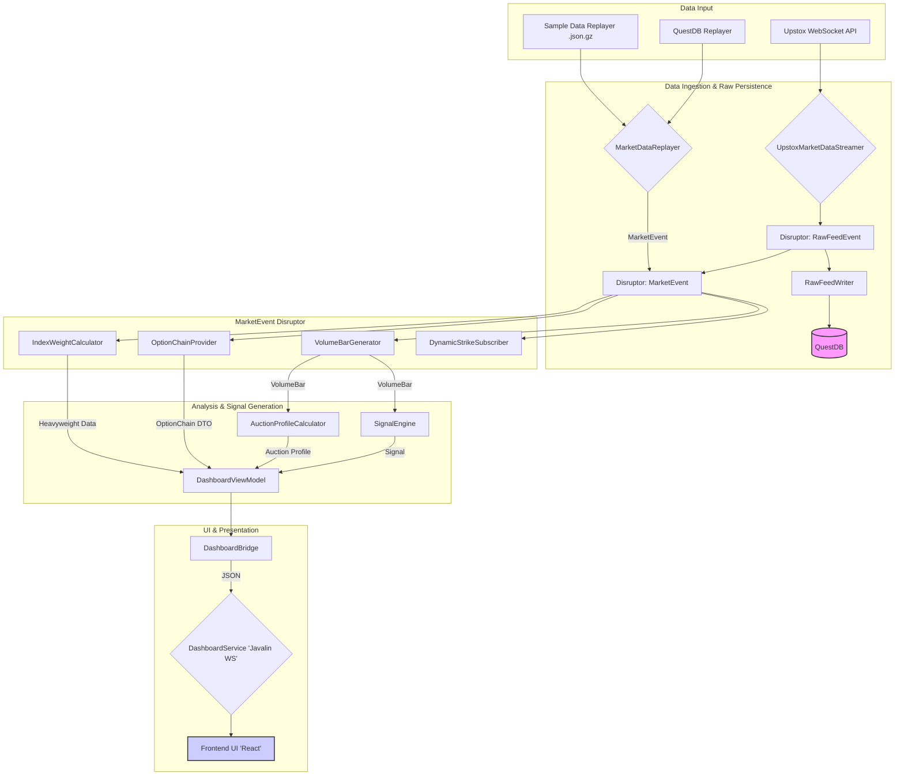

# JULES-HF-ATS: System Documentation

This document provides a comprehensive overview of the JULES-HF-ATS application, including its architecture, data flow, and the logic behind its various components.

## Table of Contents

1.  [Application Overview](#application-overview)
2.  [High-Level Architecture & Data Flow](#high-level-architecture--data-flow)
    -   [Data Flow Diagram](#data-flow-diagram)
    -   [Step-by-Step Data Flow](#step-by-step-data-flow)
3.  [Backend: `ats-core` Module](#backend-ats-core-module)
    -   [Package: `com.trading.hf`](#package-comtradinghf)
        -   [Class: `ConfigLoader`](#class-configloader)
        -   [Class: `InstrumentMaster`](#class-instrumentmaster)
        -   [Class: `DisruptorManager`](#class-disruptormanager)
        -   [Class: `UpstoxMarketDataStreamer`](#class-upstoxmarketdatastreamer)
        -   [Class: `MarketDataReplayer`](#class-marketdatareplayer)
        -   [Class: `VolumeBarGenerator`](#class-volumebargenerator)
        -   [Class: `IndexWeightCalculator`](#class-indexweightcalculator)
        -   [Class: `AuctionProfileCalculator`](#class-auctionprofilecalculator)
        -   [Class: `OptionChainProvider`](#class-optionchainprovider)
        -   [Class: `DynamicStrikeSubscriber`](#class-dynamicstrikesubscriber)
        -   [Class: `SignalEngine`](#class-signalengine)
        -   [Class: `PositionManager`](#class-positionmanager)
        -   [Class: `UpstoxOrderManager`](#class-upstoxordermanager)
        -   [Class: `ThetaExitGuard`](#class-thetaexitguard)
        -   [Class: `QuestDBWriter`](#class-questdbwriter)
    -   [Package: `com.trading.hf.service`](#package-comtradinghfservice)
    -   [Package: `com.trading.hf.utils`](#package-comtradinghfutils)
4.  [Backend: `ats-dashboard` Module](#backend-ats-dashboard-module)
    -   [Package: `com.trading.hf.dashboard`](#package-comtradinghfdashboard)
        -   [Class: `Main`](#class-main)
        -   [Class: `DashboardBridge`](#class-dashboardbridge)
        -   [Class: `DashboardService`](#class-dashboardservice)
5.  [Frontend: `ats-dashboard/frontend`](#frontend-ats-dashboardfrontend)
    -   [Hook: `useWebSocketBuffer.js`](#hook-usewebsocketbufferjs)
    -   [Component: `Dashboard.jsx`](#component-dashboardjsx)
    -   [Component: `Header.jsx`](#component-headerjsx)
    -   [Component: `AuctionWidget.jsx`](#component-auctionwidgetjsx)
    -   [Component: `HeavyweightWidget.jsx`](#component-heavyweightwidgetjsx)
    -   [Component: `OptionChain.jsx`](#component-optionchainjsx)
    -   [Component: `TradePanel.jsx`](#component-tradepaneljax)
    -   [Component: `SentimentWidget.jsx`](#component-sentimentwidgetjsx)
    -   [Component: `ActiveTradesWidget.jsx`](#component-activetradeswidgetjsx)

---

## 1. Application Overview

JULES-HF-ATS (High-Frequency Auction Trading System) is a sophisticated, event-driven trading application designed for real-time market data analysis and signal generation, with a primary focus on Auction Market Theory. It is built to process high-volume market data feeds with low latency, identify potential trading opportunities based on volume profiles and order book dynamics, and visualize this information through a comprehensive and interactive dashboard.

The system has two primary modes of operation:
*   **Live Mode**: Connects directly to the Upstox WebSocket API to receive real-time market data, process it, and generate live trading signals.
*   **Simulation Mode**: Replays historical market data from local files (`.json.gz`) or a QuestDB database. This allows for backtesting strategies, debugging logic, and developing new features without requiring a live market connection.

The core of the application is built around the LMAX Disruptor, a high-performance inter-thread messaging library, which ensures that market data is processed in a fast, efficient, and orderly manner. The system's logic is modular, with specialized components responsible for specific calculations such as volume bar generation, auction profile analysis, Nifty heavyweight stock impact, and option chain analysis.

## 2. High-Level Architecture & Data Flow

The application's architecture is designed to decouple data ingestion, processing, and presentation. This is achieved through an event-driven pipeline powered by the LMAX Disruptor.

### Data Flow Diagram

### Step-by-Step Data Flow

1.  **Data Ingestion**:
    *   In **Live Mode**, the `UpstoxMarketDataStreamer` connects to the Upstox WebSocket API. It receives raw, Protobuf-encoded market data.
    *   In **Simulation Mode**, the `MarketDataReplayer` (specifically `MySampleDataReplayer`) reads compressed JSON data from the `/resources/data` directory.

2.  **Data Parsing and Event Publication**:
    *   This step is handled differently depending on the run mode, with the end goal of publishing a standardized `MarketEvent` to the main processing disruptor.
    *   **Live Mode (`UpstoxMarketDataStreamer`)**:
        *   The application receives a raw `ByteBuffer` from the WebSocket.
        *   This binary data is parsed using the official Upstox Protobuf definition (`MarketDataFeedV3.FeedResponse.parseFrom(data)`), which deserializes it into a structured Java object.
        *   The streamer then manually extracts the relevant fields (LTP, LTQ, OI, etc.) from the deeply nested Protobuf object and uses them to populate a `MarketEvent`.
        *   If persistence is enabled, a `RawFeedEvent` is also populated and published to the raw feed disruptor.
    *   **Simulation Mode (`MySampleDataReplayer`)**:
        *   The application reads a `.json.gz` file and uses the Gson library to parse it into a generic `List<Map<String, Object>>`.
        *   For each record in the list, it manually traverses the map, retrieving values by their string keys (e.g., `ltpc.get("ltp")`).
        *   It performs explicit type casts (e.g., `((Number) value).doubleValue()`) to convert the generic objects from the JSON into the strongly-typed fields required by the `MarketEvent`.
    *   In both modes, the fully populated `MarketEvent` is published to the `MarketEvent` ring buffer for the next stage of processing.

3.  **Core Logic Processing (Parallel Handlers)**:
    *   The `MarketEvent` is consumed in parallel by several independent handlers:
        *   **`VolumeBarGenerator`**: This is a key component. It aggregates ticks from the `MarketEvent`s. When a predefined volume threshold is met for a specific instrument, it constructs and publishes a `VolumeBar` object. This shifts the analysis from being time-based to volume-based.
        *   **`IndexWeightCalculator`**: This handler listens for ticks specifically from pre-configured Nifty heavyweight stocks. It calculates their individual impact and contribution to the market's movement.
        *   **`OptionChainProvider`**: This handler processes events for options contracts. It calculates Open Interest (OI) changes and other vital statistics, packaging them into an `OptionChainDto`.
        *   **`DynamicStrikeSubscriber`**: In live mode, this listens for updates to the spot price (e.g., Nifty 50). When the price moves significantly, it calculates a new range of relevant At-the-Money (ATM) strike prices and requests the `UpstoxMarketDataStreamer` to subscribe to the corresponding option contracts.

4.  **Analysis and Signal Generation**:
    *   The `VolumeBar` events published by the `VolumeBarGenerator` are consumed by downstream components:
        *   **`AuctionProfileCalculator`**: Uses the volume bars to construct a market profile, identifying key levels like Point of Control (POC) and Value Area High/Low (VAH/VAL).
        *   **`SignalEngine`**: A placeholder for the core trading strategy. It analyzes volume bars and auction profiles to generate trading signals (e.g., Buy, Sell, Hold).

5.  **Data Aggregation for UI**:
    *   The `DashboardBridge` acts as a central hub for collecting data from all the different processing and analysis components.
    *   It receives `VolumeBar`s, signals from the `SignalEngine`, market profiles from the `AuctionProfileCalculator`, heavyweight data from the `IndexWeightCalculator`, and option chain data from the `OptionChainProvider`.
    *   It aggregates all this information into a single, unified `DashboardViewModel` object. This object represents a complete snapshot of the application's state at a given moment.

6.  **WebSocket Broadcast**:
    *   The `DashboardService`, which runs a Javalin WebSocket server, is given the `DashboardViewModel`.
    *   It serializes this view model into a JSON string.
    *   The JSON payload is then broadcast to all connected frontend clients.

7.  **Frontend Rendering**:
    *   The React-based frontend receives the JSON data via its WebSocket connection.
    *   A custom hook, `useWebSocketBuffer`, safely handles the high-frequency updates, ensuring the UI remains responsive.
    *   The data is passed down to individual React components (`AuctionWidget`, `OptionChain`, `HeavyweightWidget`, etc.), which then render the final visualization for the user.

---

## 3. Backend: `ats-core` Module

The `ats-core` module is the heart of the application. It contains all the business logic, data processing pipelines, and analytics components. It is a self-contained library that has no dependencies on the `ats-dashboard` module, ensuring a clean separation of concerns.

### Package: `com.trading.hf`

This is the root package for all core application logic.

#### Class: `ConfigLoader`

*   **Purpose**: This class is a static utility responsible for loading the application's configuration from the `config.properties` file.
*   **Logic**:
    *   It uses a `static` block to ensure that the properties are loaded only once when the class is first initialized by the JVM.
    *   It first attempts to locate `config.properties` on the Java classpath (i.e., inside the `resources` directory of the packaged JAR).
    *   If it fails to find the file on the classpath, it attempts to find it in the current filesystem directory from where the application is being run. This provides flexibility for overriding packaged configurations.
    *   If the file is not found in either location, a warning is printed, and the application continues, relying on default values provided in the code.
*   **Key Methods**:
    *   `getProperty(String key, String defaultValue)`: Retrieves a configuration value by its key, returning a default value if the key is not found.
    *   `getBooleanProperty(String key, boolean defaultValue)`: A convenience method that retrieves a property and parses it as a boolean.

#### Class: `InstrumentMaster`

*   **Purpose**: This class serves as the central in-memory database for all tradable instruments. It loads a comprehensive list of instruments from a JSON master file (`instrument-master.json`) at startup and provides efficient lookup methods for other components to resolve instrument details into the specific `instrument_key` required by the broker's API.
*   **Logic**:
    *   During construction, it reads the specified JSON resource file. This file is expected to be an array of `InstrumentDefinition` objects.
    *   It uses the Gson library for deserialization. The `@SerializedName` annotation is used to map JSON fields (e.g., `instrument_key`) to the corresponding Java fields.
    *   It builds two primary data structures for fast lookups:
        1.  `underlyingMap`: A `Map<String, List<InstrumentDefinition>>` that groups all options contracts by their `underlying_key` (e.g., "NSE_INDEX|Nifty 50"). This is crucial for finding options by strike and expiry.
        2.  `tradingSymbolToInstrumentKeyMap`: A `Map<String, String>` that provides a direct lookup from an equity's trading symbol (e.g., "RELIANCE") to its instrument key.
*   **Calculations / Key Methods**:
    *   `findInstrumentKey(String underlying, int strike, String optionType, LocalDate expiry)`: This is the primary lookup for options contracts. It takes the underlying, strike price, option type (CE/PE), and expiry date, and filters the `underlyingMap` to find the unique instrument key that matches all criteria.
    *   `findInstrumentKeyForEquity(String tradingSymbol)`: Provides a simple, direct lookup for equities and futures using their trading symbol.
    *   `findNearestExpiry(String underlying, LocalDate date)`: A utility method that finds the closest future expiry date for a given underlying, which is essential for working with near-month contracts.

#### Class: `DisruptorManager`

*   **Purpose**: This class is the central nervous system of the application. It is responsible for initializing, configuring, and managing the LMAX Disruptor instances that form the backbone of the event-driven architecture.
*   **Logic**:
    *   It creates and configures **two separate Disruptor pipelines**:
        1.  **Raw Feed Disruptor (`Disruptor<RawFeedEvent>`)**: This pipeline is dedicated to persistence. It is configured with the `RawFeedWriter` handler, which consumes `RawFeedEvent`s and writes them to QuestDB. This creates a pristine, permanent record of the entire market data feed for later analysis or replay.
        2.  **Market Event Disruptor (`Disruptor<MarketEvent>`)**: This is the main processing pipeline. It receives standardized `MarketEvent` objects. Multiple event handlers are attached to this disruptor to process events *in parallel*, with each handler performing a specific analytical task. This is where the core business logic resides.
    *   **Configuration**:
        *   `ProducerType.SINGLE`: Both disruptors are configured for a single producer thread (which will be the `UpstoxMarketDataStreamer` in live mode or a replayer in simulation mode).
        *   `YieldingWaitStrategy`: This strategy is chosen for low-latency processing, as it consumes CPU cycles while waiting for the next event, avoiding the overhead of context switches.
        *   `Thread.ofVirtual().factory()`: It uses Java 21's Virtual Threads for the event handlers, which is highly efficient for I/O-bound tasks (like writing to QuestDB) and other potentially blocking operations.
*   **Event Handlers Attached**:
    *   To `RawFeedEvent` Disruptor: `RawFeedWriter`
    *   To `MarketEvent` Disruptor: `VolumeBarGenerator`, `IndexWeightCalculator`, `OptionChainProvider`, `QuestDBWriter`.
*   **Key Methods**:
    *   `getMarketEventRingBuffer()`: Provides access to the ring buffer of the main processing disruptor, allowing producers to publish `MarketEvent`s.
    *   `getRawFeedRingBuffer()`: Provides access to the ring buffer of the raw feed disruptor, allowing producers to publish `RawFeedEvent`s for persistence.
    *   `shutdown()`: Gracefully shuts down both disruptor instances, ensuring all pending events are processed.

#### Class: `UpstoxMarketDataStreamer`

*   **Purpose**: This class is the client for the live market data feed. It handles the entire lifecycle of connecting to the Upstox WebSocket API, managing the connection, parsing incoming data, and publishing it into the application's disruptor pipelines.
*   **Logic**:
    1.  **Authorization**: It first makes an HTTP GET request to the Upstox `/authorize` endpoint, providing the access token. The response contains the unique WebSocket URL required for the connection.
    2.  **Connection**: It uses the `org.java-websocket` library to establish a connection to the retrieved URL.
    3.  **Subscription**: Once the connection is open (`onOpen`), it immediately sends a subscription request for the initial set of instrument keys provided during its construction.
    4.  **Message Handling**: The `onMessage(ByteBuffer bytes)` method is the core of the class. It receives raw binary data from the WebSocket.
        *   It parses the `ByteBuffer` using the Upstox Protobuf definition (`MarketDataFeedV3.FeedResponse`).
        *   For each market feed update within the response, it performs two actions:
            1.  It populates a `MarketEvent` object with structured data (LTP, LTQ, OI, etc.) and publishes it to the `marketEventRingBuffer` for the main processing pipeline.
            2.  If database persistence is enabled, it populates a `RawFeedEvent` with the full order book depth and other raw details and publishes it to the `rawFeedRingBuffer`.
        *   It specifically monitors the "NSE_INDEX|Nifty 50" feed to pass the latest spot price to the `DynamicStrikeSubscriber`.
*   **API Interaction**:
    *   `GET /v3/feed/market-data-feed/authorize`: To get the WebSocket URL.
    *   `WebSocket Protocol`: For receiving market data. Sends JSON messages for subscription and unsubscription requests.
*   **Key Methods**:
    *   `connect()`: Starts the entire authorization and connection process.
    *   `disconnect()`: Closes the WebSocket connection.
    *   `subscribe(Set<String> newInstrumentKeys)` / `unsubscribe(Set<String> keysToRemove)`: These methods allow for real-time modification of the market data subscriptions, enabling components like the `DynamicStrikeSubscriber` to dynamically add or remove instruments from the feed.

#### Interface: `IDataReplayer`

*   **Purpose**: This interface defines a standard contract for any class that replays historical market data. It ensures that the main application can seamlessly switch between different data sources (e.g., sample files, QuestDB) without changing its core logic.
*   **Key Methods**:
    *   `start()`: Begins the data replay process. This is typically a blocking method that reads from the data source and publishes events until the data is exhausted.

#### Class: `MySampleDataReplayer`

*   **Purpose**: This is the default implementation of `IDataReplayer`. It is responsible for reading market data from gzipped JSON files located in the project's resources directory, simulating a live data feed for development, testing, and backtesting purposes.
*   **Logic**:
    *   It identifies a hardcoded list of `.json.gz` files within the specified `data` directory in the classpath.
    *   For each file, it streams the content, decompresses it, and parses the JSON array into a list of generic `Map<String, Object>` records.
    *   It iterates through each record, introducing a configurable delay (`simulation.event.delay.ms`) between each event to simulate real-time market pacing.
    *   For each record, it calls the `publishMarketUpdate` method.
*   **Calculations / Data Transformation**:
    *   `publishMarketUpdate`: This method is responsible for the crucial step of transforming the raw, unstructured `Map` from the JSON file into a strongly-typed `MarketEvent` object.
    *   It manually extracts each required field (ltp, ltq, vtt, oi, etc.) from the map, performing necessary type conversions (e.g., from `String` or `Number` to `long` or `double`).
    *   Once the `MarketEvent` is fully populated, it publishes it to the `marketEventRingBuffer` for processing by the downstream analytical components. It does **not** publish to the raw feed ring buffer, as this data is already considered "processed" for simulation purposes.

#### Class: `VolumeBarGenerator`

*   **Purpose**: This class is one of the most important event handlers in the processing pipeline. Its function is to transform the high-frequency, tick-by-tick data stream (`MarketEvent`) into a series of `VolumeBar`s. This is the foundation of the system's Auction Market Theory approach, shifting analysis from a time-based to a volume-based perspective.
*   **Logic**:
    *   It implements the `EventHandler<MarketEvent>` interface, allowing it to be attached to the main `MarketEvent` disruptor.
    *   It maintains a `ConcurrentHashMap<String, VolumeBar>` to keep track of the "in-progress" volume bar for each instrument.
    *   For each incoming `MarketEvent`:
        1.  It checks if a running bar already exists for the instrument. If not, it creates a new `VolumeBar`, using the current tick's price and quantity as the initial open, high, low, close, and volume.
        2.  If a bar exists, it calls the `addTick` method on the `VolumeBar` object, which updates the high, low, close, and total volume.
        3.  After adding the tick, it checks if the bar's total volume has reached or exceeded the `volumeThreshold` defined in `Main.java`.
        4.  If the threshold is met, the bar is considered complete. It performs final calculations on the bar (like Order Book Imbalance), passes the completed bar to its `Consumer`s (`AuctionProfileCalculator`, `SignalEngine`, etc.), and removes the bar from the map, so a new one can be started on the next tick for that instrument.
*   **Calculations**:
    *   `determineSide(MarketEvent event)`: This calculation determines whether a trade was buyer-initiated or seller-initiated.
        *   **Logic**: It compares the Last Traded Price (LTP) with the best bid/ask prices from the order book.
        *   If `LTP >= best ask price`, it's considered an aggressive buyer (returns `1`).
        *   If `LTP <= best bid price`, it's considered an aggressive seller (returns `-1`).
        *   Otherwise, the trade is neutral (e.g., occurred within the spread) and returns `0`.
    *   `calculateOBI(MarketEvent event)`: Calculates the Order Book Imbalance.
        *   **Formula**: `(Total Buy Quantity - Total Sell Quantity) / (Total Buy Quantity + Total Sell Quantity)`
        *   **Logic**: This provides a normalized value between -1 and 1, indicating the skew of resting orders in the order book. A positive value indicates more buy-side pressure, while a negative value indicates more sell-side pressure.

#### Class: `IndexWeightCalculator`

*   **Purpose**: This `EventHandler` focuses specifically on a pre-defined list of "heavyweight" stocks (e.g., the top components of the NIFTY 50 index). Its goal is to provide a real-time measure of the net buying or selling pressure from the most influential stocks in the market.
*   **Logic**:
    *   **Initialization**: During construction, it loads the `IndexWeights.json` file. This file contains a mapping of stock trading symbols to their percentage weight in the index. It uses the `InstrumentMaster` to resolve these trading symbols into the required `instrumentKey`s for listening to events.
    *   **Event Handling**: As it receives `MarketEvent`s, it checks if the event's instrument key belongs to one of the heavyweight stocks it's tracking.
    *   If it is a heavyweight stock, it calculates the "delta" for that specific stock and updates its internal state.
*   **Calculations**:
    *   `delta`: For each incoming tick of a heavyweight stock, the delta is calculated.
        *   **Formula**: `Total Buy Quantity - Total Sell Quantity`
        *   **Logic**: This simple calculation captures the net volume at a moment in time. A positive result means more shares were bought than sold at the best bid/ask, and vice-versa.
    *   `aggregateWeightedDelta`: This is the primary output of the class. After any individual stock's delta is updated, this aggregate value is recalculated.
        *   **Formula**: `SUM(stock_delta * stock_weight)` for all heavyweight stocks.
        *   **Logic**: This calculation produces a single number that represents the overall sentiment of the market's most influential players. A large positive number suggests strong buying pressure across the key stocks, which could indicate a bullish sentiment for the entire index.

#### Class: `AuctionProfileCalculator`

*   **Purpose**: This class is a consumer of the `VolumeBar` events. Its role is to construct and maintain a `MarketProfile` for each instrument. The market profile is a histogram of volume distributed by price, which is a fundamental tool in Auction Market Theory for identifying significant price levels.
*   **Logic**:
    *   It maintains a `ConcurrentHashMap<String, MarketProfile>` to store the profile for each instrument.
    *   The `onVolumeBar(VolumeBar volumeBar)` method is called for every completed `VolumeBar`.
    *   Inside this method, it retrieves or creates the profile for the instrument. Crucially, it `synchronized`s on the `profile` object to prevent race conditions from multiple threads (though the disruptor configuration makes this less likely, it's good practice).
    *   It adds the volume from the bar to the profile at the bar's closing price.
    *   After adding the new volume, it immediately recalculates the profile's key metrics.
*   **Calculations**:
    *   **Volume at Price**: The core of the profile is a `TreeMap<Double, Long>`, which stores the total volume traded at each distinct price level.
    *   **Point of Control (POC)**: This is the price level with the highest traded volume.
        *   **Logic**: The calculator finds the entry in the `volumeAtPrice` map that has the largest value (volume). The key of this entry is the POC.
    *   **Value Area (VA)**: This is the price range where a significant portion (typically 70%) of the total volume was traded.
        *   **Logic**:
            1.  It first calculates the target volume for the Value Area (Total Volume * 0.70).
            2.  It starts its calculation at the POC.
            3.  It then iteratively expands outwards from the POC, one price level at a time. In each step, it compares the volume at the next highest price level with the volume at the next lowest price level.
            4.  It adds the larger of the two volumes to its running `currentVolume` total and expands the range (either `vah` goes up or `val` goes down).
            5.  This process continues until the `currentVolume` meets or exceeds the target 70% volume. The final `vah` (Value Area High) and `val` (Value Area Low) represent the boundaries of this significant trading zone.

#### Class: `OptionChainProvider`

*   **Purpose**: This `EventHandler` is responsible for processing `MarketEvent`s related to options contracts. It maintains the current state of the option chain and performs calculations to derive meaningful data, such as Open Interest (OI) change, for a relevant window of strike prices around the current spot price.
*   **Logic**:
    *   It listens to all `MarketEvent`s and acts as a filter.
    *   If the event is for the Nifty 50 index, it updates its internal `spotPrice` variable, which is critical for determining the ATM strike.
    *   If the event is for an options contract, identified by checking if the instrument symbol string contains the substring `" CE"` or `" PE"`, it stores the entire `MarketEvent` object in a map. This map holds the latest known state for every subscribed option contract.
    *   The `getOptionChainWindow()` method is called by the `DashboardBridge` to retrieve the data for the UI.
*   **Calculations**:
    *   **At-the-Money (ATM) Strike**: This is the central calculation, determining the focal point of the option chain.
        *   **Formula**: `round(spot_price / strike_difference) * strike_difference`
        *   **Example**: If the spot price is 22435 and the strike difference is 50, the calculation is `round(22435 / 50) * 50` = `round(448.7) * 50` = `449 * 50` = `22450`. The ATM strike is 22450.
    *   **Strike Window**: It calculates a `lowerBound` and `upperBound` based on the ATM strike and a configured `WINDOW_SIZE` to select a relevant subset of all options.
    *   **Open Interest (OI) Percentage Change**: This is a key sentiment indicator, showing where new market participation is flowing.
        *   **Formula**: `((current_oi - previous_oi) / previous_oi) * 100`
        *   **Logic**: The provider maintains an internal map (`previousOi`) to store the OI from the *last time `getOptionChainWindow` was called for that specific contract*. When a new event arrives, the new OI is used for the calculation, and then the `previousOi` map is updated for the next cycle.
        *   **Significance**: A significant positive OI change on a Call (CE) option, especially if it's breaking out, suggests strong bullish conviction. Conversely, a large OI increase on a Put (PE) option indicates strong bearish sentiment. It shows that new positions are being initiated, not just that existing positions are being traded.

#### Class: `DynamicStrikeSubscriber`

*   **Purpose**: This class is a crucial component for managing data efficiency in live mode. Its sole responsibility is to ensure that the application is only subscribed to the market data for the most relevant options contracts. It dynamically adjusts the subscription list as the underlying spot price moves, preventing the system from being overloaded with data for deep out-of-the-money or in-the-money options.
*   **Logic**:
    *   The `onNiftySpotPrice(double spotPrice)` method is called by the `UpstoxMarketDataStreamer` every time a new tick for the Nifty 50 index is received.
    *   It first checks if the current date has changed to handle expiry rollovers.
    *   It then calculates the new ATM strike based on the latest spot price. If this is different from the last known ATM, it triggers the subscription update.
    *   `updateSubscriptions()` generates a new `Set` of desired instrument keys.
    *   Finally, this `Set` is passed to a `Consumer` (the `UpstoxMarketDataStreamer`), which handles the low-level logic of subscribing to new keys and unsubscribing from old ones.
*   **PE/CE Logic**:
    *   The core of the `updateSubscriptions` method is a loop that iterates through the desired strike window (e.g., ATM +/- 4 strikes).
    *   For each strike price in the window, it makes **two** separate calls to `instrumentMaster.findInstrumentKey()`:
        1.  One call with `optionType = "CE"` to find the Call option at that strike.
        2.  One call with `optionType = "PE"` to find the Put option at that strike.
    *   This ensures that the application always subscribes to the complete options chain (both puts and calls) around the current market price.
*   **Calculations**:
    *   **At-the-Money (ATM) Strike**: This calculation is identical to the one in `OptionChainProvider`.
    *   **Subscription Set Generation**: The core logic is to generate a list of all instrument keys that should be actively monitored. It iterates from a negative window size to a positive one (e.g., -4 to +4), calculates the strike price for each step (`ATM + (i * 50)`), and then uses the `InstrumentMaster` to find the corresponding `instrumentKey` for both the Call and the Put at that strike for the current expiry.

#### Class: `SignalEngine`

*   **Purpose**: This class is the brain of the trading strategy. It consumes `VolumeBar` events and, using the context provided by the `AuctionProfileCalculator`, it interprets the market's behavior based on the principles of Auction Market Theory. Its primary role is to identify the current "auction state" and detect specific trading opportunities like initiative and absorption.
*   **Logic**:
    *   It operates as a **State Machine**. For each instrument, it tracks the current `AuctionState` (e.g., `ROTATION`, `DISCOVERY_UP`, etc.).
    *   On receiving a new `VolumeBar`, it fetches the latest `MarketProfile` for that instrument.
    *   It then evaluates a set of rules based on the bar's closing price and cumulative delta relative to the profile's Value Area High (VAH), Value Area Low (VAL), and Point of Control (POC).
    *   Based on these rules, it determines if the `AuctionState` should transition. For example, if the state is `ROTATION` (i.e., balanced) and the price breaks above the VAH with strong positive delta, the state transitions to `DISCOVERY_UP`.
*   **Auction States**:
    *   `ROTATION`: The market is balanced and trading within the established value area.
    *   `DISCOVERY_UP`: The market has broken above the value area and is actively searching for new sellers ("discovery").
    *   `DISCOVERY_DOWN`: The market has broken below the value area and is actively searching for new buyers.
    *   `REJECTION_UP`: The market attempted to break out upwards but failed and has fallen back below the VAH. This is a potential sign of a failed auction.
    *   `REJECTION_DOWN`: The market attempted to break out downwards but failed and has moved back above the VAL.
*   **Calculations / Signal Logic**:
    *   **Initiative Signal**: This signal identifies a decisive breakout from the value area.
        *   **Logic**: An "Initiative Buy" is flagged when the auction state is `ROTATION`, the price closes *above* the VAH, and the volume delta is *positive* (confirming buyer aggression). An "Initiative Sell" is the inverse.
    *   **Absorption Signal**: This signal identifies a situation where a potential breakout is being quietly absorbed by large passive orders.
        *   **Logic**: An "Absorption at VAH" is flagged when the price is hovering right at the VAH, but the volume delta is *negative*. This divergence is significant: it suggests that aggressive sellers are hitting the VAH, but large passive buyers are absorbing all the selling pressure, preventing the price from falling. This can be a strong bullish signal. Absorption at VAL is the inverse.

#### Class: `PositionManager`

*   **Purpose**: This class acts as a simple, in-memory repository for all open trading positions. It provides a centralized location for the application to query the state of its current portfolio.
*   **Logic**:
    *   It uses a `ConcurrentHashMap` to store `Position` objects, keyed by their `instrumentKey`.
    *   It provides basic CRUD-like operations: `addPosition`, `removePosition`, and `getPosition`.
    *   It is designed to be thread-safe, allowing different components to query or update positions without causing concurrency issues.

#### Class: `UpstoxOrderManager`

*   **Purpose**: This class is a dedicated service that encapsulates all interactions with the Upstox Order API. It provides a simplified interface for other parts of the application to execute trades (place, modify, cancel) without needing to know the low-level details of the Upstox API.
*   **Logic**:
    *   It is initialized with the user's `accessToken`, which it uses to configure the Upstox API client.
    *   **Order Placement**: The `placeOrder` method constructs a `PlaceOrderRequest` object, populating it with details like instrument, quantity, side, and order type.
    *   **Position Tracking Caveat**: A critical piece of logic resides here. After a successful order placement, the manager attempts to update the `PositionManager`.
        *   For **LIMIT** orders, it assumes the fill price is the same as the order price and immediately adds the position.
        *   For **MARKET** orders, the final fill price is unknown when the order is placed. To avoid tracking positions with inaccurate entry prices, it logs a critical warning and **does not** add the position to the manager. This highlights a known limitation: the system requires a separate "fill-tracking" service (e.g., a webhook or polling mechanism) for accurate P&L on market orders.
*   **API Interaction**:
    *   `POST /v2/order/place`: To place a new order.
    *   `PUT /v2/order/modify`: To modify a pending order.
    *   `DELETE /v2/order/cancel`: To cancel a pending order.

#### Class: `ThetaExitGuard`

*   **WARNING**: This class is **non-functional** in its current state. Its logic depends on a `getTheta()` method on the `MarketEvent` object, which does not exist in the current data model. The documentation below describes its intended, hypothetical functionality.
*   **Purpose**: This class is intended to be a risk management component. As an `EventHandler`, it would monitor open positions and automatically trigger an exit order if the position's value deteriorates due to time decay (theta) beyond a certain threshold.
*   **Intended Logic**:
    *   For each incoming `MarketEvent`, it would check if the event's instrument corresponds to an open position in the `PositionManager`.
    *   If it does, it would calculate the current unrealized Profit and Loss (P&L) of the position.
    *   It would then calculate the theoretical loss due to theta decay based on how long the position has been open.
    *   If the combined P&L and theta decay loss exceeds a predefined threshold, it would automatically place a market order to close the position.
*   **Hypothetical Calculations**:
    *   **P&L**: `(current_ltp - entry_price) * quantity` (for a BUY position).
    *   **Theta Decay Loss**: `theta_value * time_in_market`
    *   **Exit Condition**: `pnl + theta_decay_loss < -THETA_DECAY_THRESHOLD`

#### Class: `QuestDBWriter`

*   **Purpose**: This `EventHandler` provides the persistence layer for processed, structured market data. It connects to a QuestDB time-series database and writes each `MarketEvent` as a new row in a table. This creates a historical record of cleaned data that can be used for analysis or for the `QuestDBReplayer`.
*   **Logic**:
    *   It implements both `EventHandler<MarketEvent>` and `AutoCloseable`.
    *   **Connection**: It uses the official QuestDB `Sender` client to establish a TCP connection to the database on port 9009.
    *   **Event Handling**: For each `MarketEvent`, it builds a new row for the `ticks` table.
        *   It maps each field from the `MarketEvent` (e.g., `getLtp()`) to its corresponding column in the database (e.g., `doubleColumn("ltp", ...)`).
        *   The `symbol` column is designated as a QuestDB `symbol` type, which is an indexed and efficient way to store repeating string values.
        *   The timestamp for the row is taken from the `MarketEvent`.
    *   **Batching/Flushing**: To achieve high throughput, the `Sender` client buffers records in memory. The `QuestDBWriter` implements a flushing mechanism to send these buffers to the database. It flushes the data if either 10,000 events have been received or 1 second has passed since the last flush. This is a common and effective strategy to balance write latency and throughput.
*   **API Interaction**:
    *   Connects to QuestDB's InfluxDB Line Protocol endpoint, typically `localhost:9009`.

### Package: `com.trading.hf.service`

**Note**: This package appears to be a remnant of a previous design iteration and is **not actively used** in the current application logic. The functionality of receiving and distributing market data has been superseded by the `UpstoxMarketDataStreamer` and the LMAX Disruptor pattern.

#### Class: `MarketDataFeedService` & `MarketDataFeedListener`

*   **Purpose (Obsolete)**: These classes represent a basic Observer design pattern. The `MarketDataFeedService` would have been responsible for taking a raw `MarketDataFeed.Feed` object and passing it to a listener that implemented the `MarketDataFeedListener` interface.
*   **Current Status**: This direct listener/callback pattern was likely replaced because the Disruptor provides a much more powerful and performant way to handle event distribution to multiple parallel consumers with proper back-pressure and batching.

### Package: `com.trading.hf.utils`

#### Class: `ProtobufDecoder`

*   **Purpose (Obsolete)**: This is a simple utility class designed for a single purpose: to decode a byte array into a structured `MarketDataFeed.FeedResponse` object using the Google Protocol Buffers library.
*   **Current Status**: This class is **not actively used**. The logic for decoding Protobuf messages is now handled directly inside the `onMessage(ByteBuffer bytes)` method of the `UpstoxMarketDataStreamer`. Consolidating this logic into the streamer class likely simplified the data flow, removing the need for this separate utility.

---

## 4. Backend: `ats-dashboard` Module

This module serves two primary purposes: it contains the `Main` class, which is the application's entry point, and it provides the WebSocket bridge that serves aggregated data to the frontend UI.

### Class: `Main`

*   **Purpose**: This is the main entry point for the entire JULES-HF-ATS application. It is responsible for initializing all the core components, wiring them together, and starting the appropriate data feed (live or simulation) based on the configuration.
*   **Logic**:
    1.  **Configuration Loading**: It reads the `config.properties` file to determine the run mode (`live` or `simulation`), whether the dashboard and QuestDB are enabled, and other parameters.
    2.  **Core Component Initialization**: It creates instances of all the key `ats-core` services: `InstrumentMaster`, `IndexWeightCalculator`, `AuctionProfileCalculator`, `SignalEngine`, `OptionChainProvider`, `VolumeBarGenerator`, and the `DisruptorManager` which connects them all.
    3.  **Dashboard Bridge Startup**: If the dashboard is enabled in the config, it calls `DashboardBridge.start()`, passing in all the necessary data providers.
    4.  **Mode Selection**:
        *   If in **Live Mode**, it initializes the `UpstoxMarketDataStreamer` and `DynamicStrikeSubscriber`, and connects to the live WebSocket feed.
        *   If in **Simulation Mode**, it initializes the `MySampleDataReplayer` and starts the replay process. In this mode, it also enters an infinite loop (`while(true)`) to keep the main thread alive, ensuring the Javalin web server continues to run and serve the UI even after the data replay is finished.

### Package: `com.trading.hf.dashboard`

This package contains all the components required to bridge the data from the `ats-core` module to the frontend.

#### Class: `DashboardBridge`

*   **Purpose**: This class acts as the central data aggregator and coordinator for the UI. It connects the raw data producers in `ats-core` to the `DashboardService` that will broadcast the data.
*   **Logic**:
    *   The static `start()` method is called from `Main`. It initializes a singleton `DashboardService`.
    *   Its primary logic resides in a `Consumer` that is passed to the `VolumeBarGenerator`. This means the `DashboardBridge`'s code is executed **every time a new `VolumeBar` is completed**.
    *   Inside this consumer, it constructs a new `DashboardViewModel`.
    *   It then populates this view model by calling the getter methods on all the `ats-core` data providers it was given (e.g., `auctionProfileCalculator.getProfile()`, `optionChainProvider.getOptionChainWindow()`, etc.). This process effectively takes a snapshot of the entire application's analytical state.
    *   Finally, it serializes the fully populated `DashboardViewModel` into a JSON string using Gson and hands it off to the `DashboardService` to be broadcast.

#### Class: `DashboardService`

*   **Purpose**: This class implements the WebSocket server that the frontend connects to. It manages client connections and broadcasts data.
*   **Logic**:
    *   It uses the **Javalin** web server library to create a WebSocket endpoint at `/data` on port `7070`.
    *   **Connection Management**: It maintains a `Set` of all active WebSocket sessions (`WsContext`).
    *   **CORS Configuration**: It correctly configures CORS to allow the frontend development server (running on a different port, e.g., 5173) to connect to it.
    *   **Broadcasting**: The `broadcast(String message)` method is called by the `DashboardBridge`. It iterates through all active sessions and sends the JSON message to each one.
    *   **State for New Connections**: It stores the `lastMessage` that was broadcast. When a new client connects, it immediately sends this last message, ensuring the UI populates with the latest data instantly instead of waiting for the next `VolumeBar`.

#### Class: `DashboardViewModel`

*   **Purpose**: This class is a **Data Transfer Object (DTO)**. Its sole purpose is to define the data structure that will be sent to the frontend. It acts as the data contract between the Java backend and the React frontend.
*   **Logic**:
    *   It contains public fields that map directly to the structure of the JSON object the frontend will receive.
    *   It uses nested static inner classes (e.g., `MarketProfileViewModel`, `OptionViewModel`) to create a clean, hierarchical JSON structure.
    *   This class is crucial because it decouples the frontend's data needs from the internal data structures of the `ats-core` module. For example, it transforms the raw `Heavyweight` object into a `HeavyweightViewModel` with a formatted `weight` string, so the frontend doesn't have to.

---

## 5. Frontend: `ats-dashboard/frontend`

The frontend is a modern React 18+ application built using Vite. It is responsible for visualizing the complex, high-frequency data broadcast by the Java backend in a clear and performant manner.

### Hook: `useWebSocketBuffer.js`

*   **Purpose**: This custom React hook is the cornerstone of the frontend's performance strategy. It is designed to consume a high-frequency WebSocket stream without overwhelming the React rendering engine and causing the UI to freeze or lag.
*   **Logic**:
    1.  It establishes and maintains a connection to the WebSocket server (`ws://localhost:7070/data`).
    2.  When a new message arrives, it **does not** immediately call `setData()` to trigger a re-render. Instead, it pushes the parsed JSON data into a simple array (`buffer.current`).
    3.  It uses `requestAnimationFrame()` to create a rendering loop that is synchronized with the browser's paint cycle (typically 60 times per second).
    4.  Inside the animation loop, it checks if the buffer contains any new messages. If it does, it takes **only the last message** from the buffer, updates the component's state with this single message, and then clears the buffer.
*   **Calculations / Performance**:
    *   **Throttling**: The primary benefit is that it effectively throttles the UI updates to the browser's refresh rate. Even if the backend sends 200 messages per second, the UI will only re-render a maximum of 60 times, and it will always render the most recent data. This prevents stuttering and makes the UI feel smooth and responsive.

### Component: `Dashboard.jsx`

*   **Purpose**: This is the main parent component for the entire user interface. It defines the overall grid layout of the dashboard.
*   **Logic**:
    *   It is the sole component in the application that calls the `useWebSocketBuffer` hook to initiate the data stream.
    *   It receives the single, consolidated `data` object (which corresponds to the `DashboardViewModel` from the backend) on each frame.
    *   It then passes this entire `data` object down as a prop to each of the individual child "widget" components. This is a simple and effective way of distributing the application state without needing a more complex state management library like Redux.

### Widget Components

The following components receive the `data` prop from `Dashboard.jsx` and are responsible for rendering a specific piece of the UI.

*   **`Header.jsx`**: Displays the global information from the top level of the view model, such as the current timestamp, symbol, and spot price.
*   **`AuctionWidget.jsx`**: Visualizes the data from `data.auctionProfile`, displaying the Value Area High (VAH), Value Area Low (VAL), and Point of Control (POC).
*   **`HeavyweightWidget.jsx`**: Renders the list of heavyweight stocks from `data.heavyweights` and displays the `data.aggregateWeightedDelta`, likely as a summary bar or gauge.
*   **`OptionChain.jsx`**: Renders the `data.optionChain` array into a table, showing the strike, LTP, and OI change for the active options window. It likely applies conditional styling based on the `sentiment` field.
*   **`TradePanel.jsx`**: Displays information relevant to trade execution, such as the `data.thetaGuard` timer.
*   **`SentimentWidget.jsx`**: Displays the overall market sentiment, primarily the `data.auctionState` (e.g., "ROTATION", "DISCOVERY_UP").
*   **`ActiveTradesWidget.jsx`**: (No direct data feed in the view model). This component would be responsible for displaying the user's current open positions, likely by fetching them from a separate API endpoint in the future.
